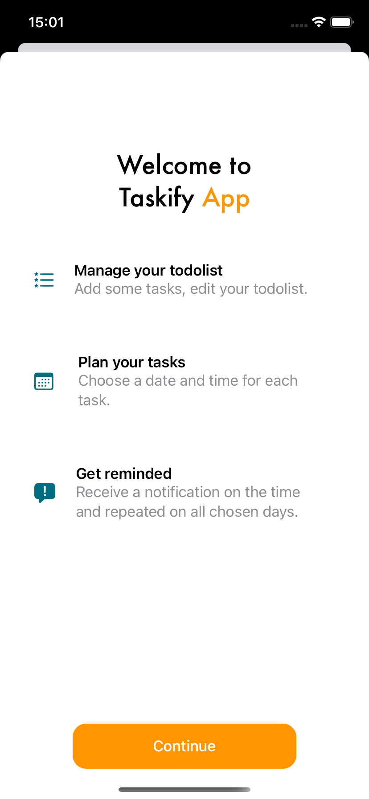
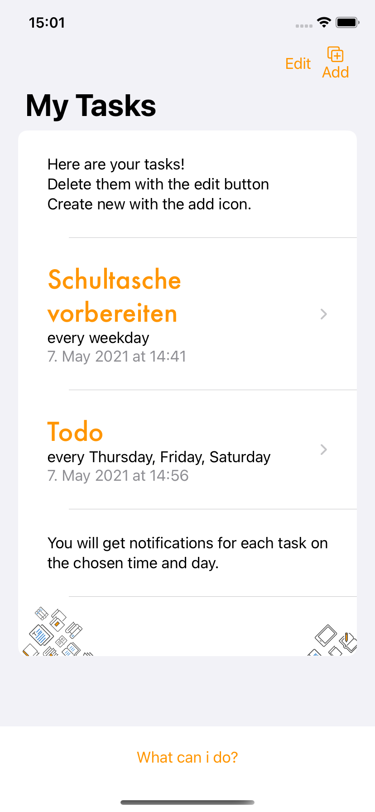
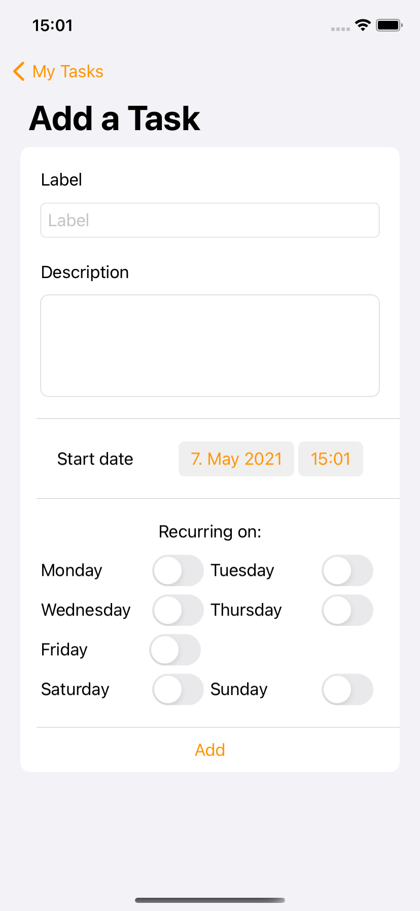
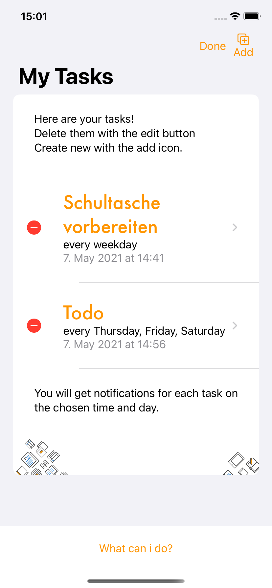
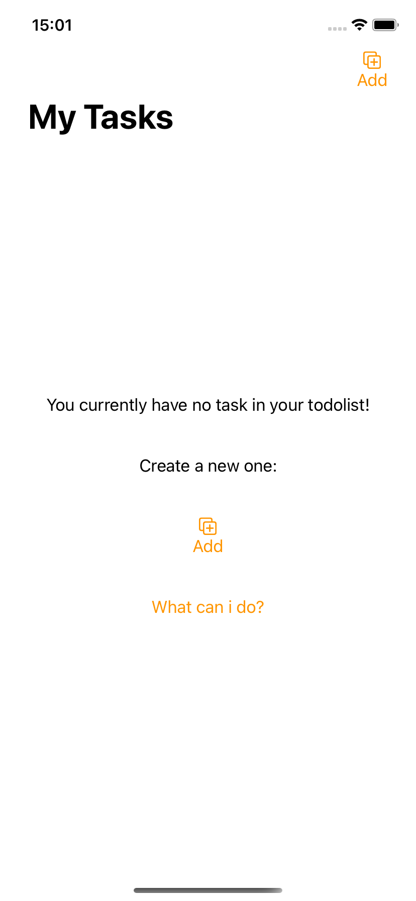
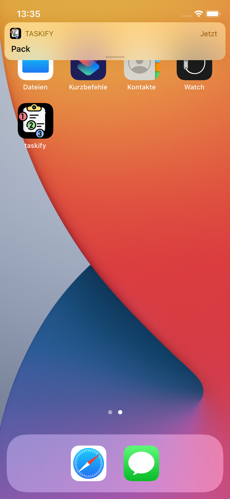
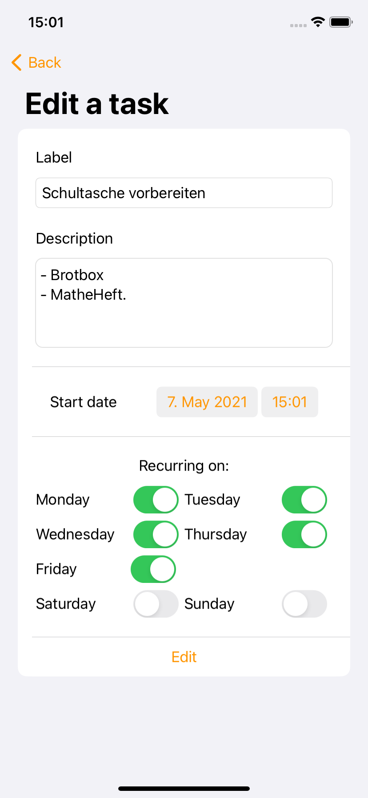

# taskify - Todolist Manager
iOS App project for the swiftUI beginner course
- Create and edit task with a day and time, optional recurring
- Notifications are created at the chosen time
- Tasks are saved on the AppStorage

     

